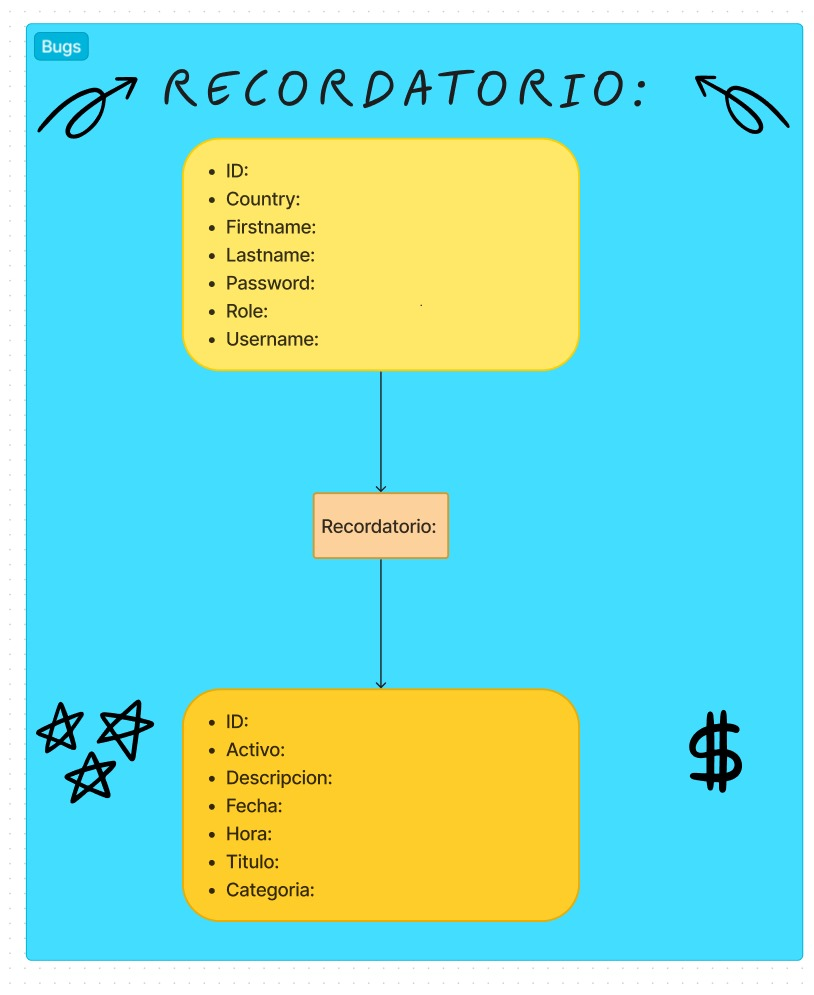
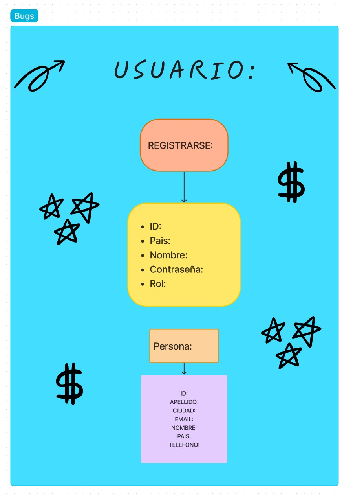

# Control de Recordatorio y Seguimiento Personalizado para la Gestión Integral del Tiempo y las Responsabilidades Laborales y Personales

## Necesidad

La empresa requiere un sistema de recordatorio personalizado para sus empleados, con el fin de mejorar la gestión del tiempo y las responsabilidades laborales y personales.

## Análisis: Definición de Requerimientos

### Requerimientos Funcionales

**RF1: Gestión de Usuarios**

- El sistema debe permitir el registro de usuarios, incluyendo atributos como país, primer nombre, segundo nombre, contraseña, rol y nombre de usuario.

**RF2: Gestión de Categorías de Recordatorios**

- El sistema debe tener la capacidad de clasificar los recordatorios en diferentes categorías, cada una asociada a un usuario específico.

**RF3: Gestión de Recordatorios**

- El sistema debe permitir a los usuarios crear recordatorios personalizados, especificando detalles como archivo adjunto, descripción, fecha, hora, título y categoría.

### Requerimientos No Funcionales

**RNF1: Integridad de Datos**

- El sistema debe asegurar la integridad de los datos, mediante el uso de claves primarias y foráneas en las tablas de la base de datos.

**RNF2: Rendimiento del Sistema**

- El sistema debe ser capaz de manejar múltiples usuarios y recordatorios simultáneamente, sin afectar significativamente su rendimiento.

**RNF3: Seguridad de Datos**

- El sistema debe proteger la información almacenada, asegurando que solo el personal autorizado tenga acceso a los recordatorios y datos de los usuarios.

**RNF4: Escalabilidad**

- El sistema debe ser escalable para soportar un crecimiento en el número de usuarios y recordatorios sin requerir cambios importantes en su estructura.

**RNF5: Disponibilidad y Recuperación de Datos**

- El sistema debe garantizar la disponibilidad de los datos y contar con mecanismos de respaldo para la recuperación ante posibles fallos o pérdida de información.

## User

| Id  | PrimerNombre | SegundoNombre | Username | Contraseña | País      | Rol           |
| --- | ------------ | ------------- | -------- | ---------- | --------- | ------------- |
| 01  | Camila       | Alexandra     | Camila   | ****       | Argentina | Participante  |
| 02  | Andres       | Camilo        | Andres   | ***        | Rusia     | Participante2 |
| 03  | Paula        | Sofia         | Paula    | **         | Polonia   | Participante3 |

## Categoria

| Id  | Nombre            | Descripcion         | User_Id |
| --- | ----------------- | ------------------- | ------- |
| 01  | Universidad       | Ir a la Universidad | 03      |
| 02  | Pastas            | Ir por las pastas   | 01      |
| 03  | Medicamentos      | Tomar Medicamentos  | 02      |

## Recordatorio

| Id  | Titulo            | Descripcion        | Fecha      | Hora   | Categoria_Id |
| --- | ----------------- | ------------------ | ---------- | ------ | ------------ |
| 01  | Importante        | Levantate Temprano | 20/05/2024 | 3:00pm | 02           |
| 02  | Importante        | Debes ir           | 23/05/2024 | 7:00pm | 03           |
| 03  | Importante        | Es importante      | 27/05/2024 | 3:50pm | 01           |


## Diseño de Diagramas

### [Diagrama de Clases](IMG/DiagramaClases/Clases.wsd)


### [Diagrama de Secuencia](IMG/DiagramaSecuencia/Secuencia.wsd)


### [Diagrama de Casos de Uso](IMG/DiagramaCasosdeUso/Casosdeuso.wsd)


## Diseñar Base de Datos

> Ver:

### [Diagrama MR](IMG/Mr/MR.wsd)

> 

> Script de la base de datos:

```sql
   DROP DATABASE IF EXISTS SistemaDeRecordatorioPersonalizado;

    CREATE DATABASE SistemaDeRecordatorioPersonalizado;

    USE SistemaDeRecordatorioPersonalizado;

    CREATE table User(
        Id INT NOT NULL PRIMARY KEY AUTO_INCREMENT,
        Primer nombre VARCHAR(50) NOT NULL,
        Segundo nombre VARCHAR(50) NOT NULL,
        Username VARCHAR(50) NOT NULL,
        Contraseña VARCHAR(50) NOT NULL,
        País VARCHAR(50) NOT NULL,
        Rol VARCHAR(50) NOT NULL

    );

    CREATE table Categoria(
        id INT NOT NULL PRIMARY KEY AUTO_INCREMENT,
        nombre VARCHAR(50) NOT NULL,
        descripcion VARCHAR(50) NOT NULL,
        user_Id INT NOT NULL,
        FOREIGN KEY (user_Id) REFERENCES User(Id)
    );

    CREATE table Recordatorio(
        id INT NOT NULL PRIMARY KEY AUTO_INCREMENT,
        titulo VARCHAR(50) NOT NULL ,
        descripcion VARCHAR(50) NOT NULL ,
        arctivo  BOOLEAN NOT NULL,
        fecha DATE NOT NULL,
        hora DATETIME,
        categoria_Id INT NOT NULL,
        FOREIGN KEY (categoria_Id) REFERENCES Categoria(Id)

    );


```

# Ver planificación

[Ver Aquí](https://trello.com/b/sloMX50s/proyecto)

## MOCKUP logica

> Mockup:
> 

> Mockup:
> 
