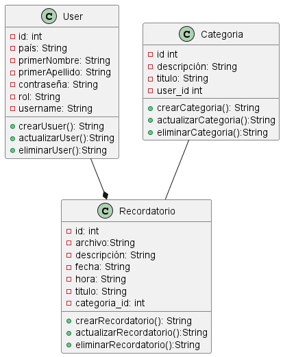
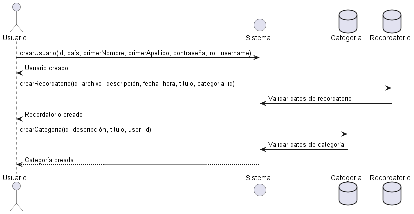
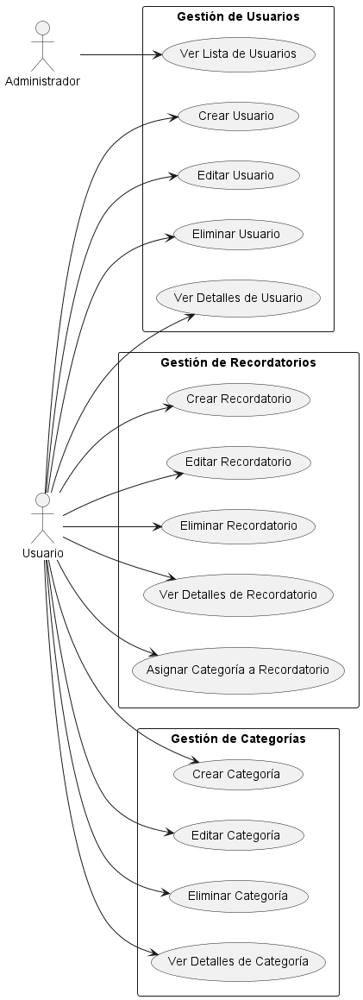
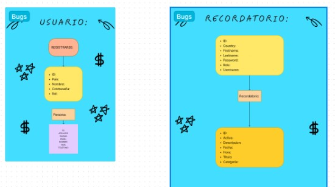

# Control de Recordatorio y Seguimiento Personalizado para la Gestión Integral del Tiempo y las Responsabilidades Laborales y Personales

## Necesidad

La empresa requiere un sistema de recordatorio personalizado para sus empleados, con el fin de mejorar la gestión del tiempo y las responsabilidades laborales y personales.

## Análisis: Definición de Requerimientos

### Requerimientos Funcionales

**RF1: Gestión de Usuarios**
- El sistema debe permitir el registro de usuarios, incluyendo atributos como país, primer nombre, segundo nombre, contraseña, rol y nombre de usuario.

**RF2: Gestión de Categorías de Recordatorios**
- El sistema debe tener la capacidad de clasificar los recordatorios en diferentes categorías, cada una asociada a un usuario específico.

**RF3: Gestión de Recordatorios**
- El sistema debe permitir a los usuarios crear recordatorios personalizados, especificando detalles como archivo adjunto, descripción, fecha, hora, título y categoría.

### Requerimientos No Funcionales

**RNF1: Integridad de Datos**
- El sistema debe asegurar la integridad de los datos, mediante el uso de claves primarias y foráneas en las tablas de la base de datos.

**RNF2: Rendimiento del Sistema**
- El sistema debe ser capaz de manejar múltiples usuarios y recordatorios simultáneamente, sin afectar significativamente su rendimiento.

**RNF3: Seguridad de Datos**
- El sistema debe proteger la información almacenada, asegurando que solo el personal autorizado tenga acceso a los recordatorios y datos de los usuarios.

**RNF4: Escalabilidad**
- El sistema debe ser escalable para soportar un crecimiento en el número de usuarios y recordatorios sin requerir cambios importantes en su estructura.

**RNF5: Disponibilidad y Recuperación de Datos**
- El sistema debe garantizar la disponibilidad de los datos y contar con mecanismos de respaldo para la recuperación ante posibles fallos o pérdida de información.

  ### Diseñar Base de Datos

* `User`

| Id |Pais      |PrimerNombre |segundoNombre|Contraseña| Rol         | Username |
|----|----------|-------------|-------------|----------|-------------|----------|
| 01 |Argentina |Camila       |Alexandra    |********  |Participante | Camila   |
| 02 |Rusia     |Andres       |Camilo       |*****     |Participante2| Andres   |
| 03 |Polonia   |Paula        |Sofia        |****      |Participante3| Paula    |

* `Categoria`

| Id |Descripcion         |User_Id |
|----|--------------------|--------|
| 01 |Ir a la Universidad |   03   |
| 02 |Ir por las pastas   |   01   |   
| 03 |Tomar Medicamentos  |   02   |

* `Recordatorio`

| Id |    Descripcion    |Fecha       |Hora    | Titulo   | Categoria_Id   |
|----|-------------------|------------|--------|----------|----------------|
| 01 |Levantate Temprano |20/05/2024  |3:00pm  |Importante|   02           |
| 02 |Debes  ir          |23/05/2024  |7:00pm  |Importante|   03           | 
| 03 |Es importante      |27/05/2024  |3:50pm  |Importante|   01           | 

## Diseño de Diagramas

### [Diagrama de Clases](IMG/DiagramaClases/Clases.wsd)



### [Diagrama de Secuencia](IMG/DiagramaSecuencia/Secuencia.wsd)




### [Diagrama de Casos de Uso](IMG/DiagramaCasosdeUso/Casosdeuso.wsd)




## Diseñar Base de Datos

> Ver:
### [Diagrama MR](IMG/Mr/MR.wsd)
> 

> Script de la base de datos:

```sql
   DROP DATABASE IF EXISTS SistemaDeRecordatorioPersonalizado;

    CREATE DATABASE SistemaDeRecordatorioPersonalizado;

    USE SistemaDeRecordatorioPersonalizado;

    CREATE table User(
        Id INT NOT NULL PRIMARY KEY AUTO_INCREMENT,
        País VARCHAR(50) NOT NULL,
        Primer nombre VARCHAR(50) NOT NULL,
        Segundo nombre VARCHAR(50) NOT NULL,
        Contraseña VARCHAR(50) NOT NULL,
        Rol VARCHAR(50) NOT NULL,
        Username VARCHAR(50) NOT NULL,

    );

    CREATE table Categoria(
        Id INT NOT NULL PRIMARY KEY AUTO_INCREMENT,
        Descripcion VARCHAR(50) NOT NULL,
        User_Id INT NOT NULL,
        FOREIGN KEY (User_Id) REFERENCES User(Id)
    );

    CREATE table Recordatorio(
        Id INT NOT NULL PRIMARY KEY AUTO_INCREMENT,
        Archivo VARCHAR(50) NOT NULL,
        Descripcion VARCHAR(50) NOT NULL ,
        Fecha DATE NOT NULL,
        Hora DATETIME,
        Titulo VARCHAR(50) NOT NULL ,
        Categoria_Id INT NOT NULL,
        FOREIGN KEY (Categoria_Id) REFERENCES Categoria(Id)

    );


```
# Ver planificación
[Ver Aquí](https://trello.com/b/sloMX50s/proyecto)

## MOCKUP logica

   > Ver:
   > 
